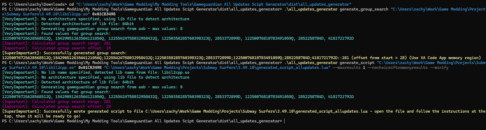

# Gameguardian All Updates Script Generator



This CLI tool allows you to make a Gameguardian script that works for all updates. It uses AOB (array of bytes) searching techniques to dynamically find a target function, even if the offset or name of the function changes. This allows you to make scripts that rely on specific functions - such as hex patching, hooking, or function calling - that will not break when offsets change in the next update.

Note that this technique is not foolproof. If the function's code is edited, it may or not not break the search. In this case, you will have to re-find the function, then run this tool again.

**Disclaimer: THIS TOOL IS FOR EDUCATIONAL PURPOSES. I AM NOT LIABLE FOR ANY MISUSE.**

> This tool has yet to be fully tested (I got lazy). If you run into an error, feel free to file an [issue](https://github.com/HorridModz/https://github.com/HorridModz/Gameguardian-All-Updates-Script-Generator/issues/new/) or reach out on Discord (`@horridmodz`).

# Usage

If you would like to jump ahead to instructions for using your generated script template, see [Generated Scripts](#generated-scripts).

### Installation

This tool is available as a CLI application. For Windows users, you can download the [latest release](https://github.com/HorridModz/Gameguardian-All-Updates-Scipt-Generator/releases/latest/download/all_updates_generator.zip) and run `all_updates_generator.exe` in your terminal.

For other platforms, you can download the [Source Code](https://github.com/HorridModz/Gameguardian-All-Updates-Scipt-Generator/releases/tag/V1.0), extract it, and run the file `src\cli\cli.py` in your terminal. Make sure that you have [Python 3](https://www.python.org/downloads/) installed, and you must install the [requirements](https://github.com/HorridModz/Gameguardian-All-Updates-Scipt-Generator/blob/main/requirements.txt) via:
```sh
pip install -r requirements.txt
```

> [!NOTE]
> While everything in this tool should be cross-platform, it has only been tested on Windows. Support for other platforms is not guaranteed.

### Commands

> [!TIP]
> To see help (a comprehensive list of instructions for using the tool with detailed descriptions for every command and parameter), run:
> ```sh
> all_script_generator -h
> ```

To generate a group search from a lib file and offset:

```all_updates_generator generate_group_search <lib> <offset> [<architecture>] [--hex <hex>] [--architecture <architecture>] [--maxvalues <max_values>] [--prefernooffset]```

**Example**:
```sh
all_updates_generator generate_group_search "C:\Desktop\libil2cpp.so"
0xFC6781
```

... Or from a hex value:

```all_updates_generator generate_group_search --hex <hex> [--architecture <architecture>] [--maxvalues <max_values>][--prefernooffset]```

**Example**:
```sh
all_updates_generator generate_group_search "C:\Desktop\libil2cpp.so"
--hex 1F B4 09 CD 21 B8 01 4C CD21 90 90 54 68 69 73 20 70 72 6F 67 72 61 6D 20 6D 75 73
74 20 62 65 20 72 75 6E 20 75 6E  64 65 72 20 57 69 6E 36 34 0D 0A 24 37
```

### **However, it is *recommended* to directly generate a Gameguardian script template that automatically performs your search for you - this way you don't have to manually code the search logic:**

```
generate_script all_updates_generator generate_script <lib_file> (<offset>) [--numberofbytes <bytes_num>]
 | --hex <hex>) [--architecture <architecture>] <output_path> [--lib_name <lib_name>]
 [--maxvalues <max_values>] [--maxresults <max_results>]
 [--nochoiceiftoomanyresults] [--minify]`
```

**Example with offset**:
```sh
all_updates_generator generate_script "C:\Desktop\libil2cpp.so"
0xFC6781 "C\Desktop\my_script.lua"
```

**Example with hex**:
```sh
all_updates_generator generate_script "C:\Desktop\libil2cpp.so"
--hex 1F B4 09 CD 21 B8 01 4C CD 21 90 90 54 68 69 73 20 70 72 6F 67 72 61 6D 20 6D
75 73 74 20 62 65 20 72 75 6E 20 75 6E 64 65 72 20 57 69 6E 36 34 0D 0A 24 37
"C\Desktop\my_script.lua"
```

> [!TIP]
> The generated script template is long - around 170 lines. Supply the `--minify` flag if you would like it to be made as small as possible and condensed into a single line.

> [!TIP]
> You will often get a lot of results in your generated group searches / scripts. To narrow it down, increase `numberofbytes` (default is 1000 - try using `--numberofbytes 2000`) and/or `maxvalues` (default is 8 - try using `--maxvalues 20`). These options do have downsides - `numberofbytes` will make the script more likely to break (though an increase from 1000 to 2000 is neglibible); `maxvalues` can make the search take a bit longer. Play around with them if your search is getting too many results - you may have to use both.

### Optional Arguments:

*These arguments apply to both `generate_group_search` and `generate_script`:

- `architecture <string>`: Force the program to use 32bit or 64bit architecture (put `32bit` or `64bit`). This is not recommended, as it should automatically detect the architecture from the lib file.
- `numberofbytes <number>`: How many bytes to read when getting hex from lib file and offset (not applicable when hex is supplied instead) - default is 1000. The more bytes that are read
  past the end of the function (e.g. if numberofbytes is 1000 and the function is 300 bytes), the more dependent the aob will be on adjacent functions (usually methods of the same class or namespace) rather than just the function itself, and the more likely the search is to break when these functions are changed or reordered. Thus, the higher this value is, the more precise the group search may be - but also, the higher the chance of the group search breaking.
- `maxvalues <number>`: Goal for how many values to put in generated group search, if this many can be found (**default 8**). Increasing this number will make the group search more precise and decrease the odds of getting multiple results, but in turn it will be slower. It is not recommended to change this unless you have a good reason - however, if you are getting too many results and need to decrease the number, increasing this value is the recommended way. The maximum is 64 due to gameguardian's limitations,  though you should never realistically need this many.

**Specific to `generate_group_search`**:

- `prefernooffset`: Whether to try to generate a group search which includes the first bytes of the aob.  This will make the offset 0 and thus mean that the first result when the group search is performed will be the start of the function, saving you the trouble of having to
  calculate the function's start address in the gameguardian script. However, it may make the group search slightly less precise. Also, it may fail (if the first bytes of the aob are not static).

**Specific to `generate_script`**:

- `libname <string>`: Manually specify the name of the shared library the target function is in (usually libil2cpp.so for il2cpp games). This should match the name of the .so file, unless the file has been renamed. If not given, the lib name will be set to the name of the lib file.
- `maxresults <number>`: The maximum results (number of functions)
  permitted in the script when the group search is performed. If more than
  this many results are found, the generated script will show a warning and ask the user if they want to
  continue or exit - or, if nochoiceiftoomanyresults is set, exit
  immediately, as editing too many results may cause (usually harmless) glitches or crashes. Set to -1 to permit any amount of results. Default 30.
- `nochoiceiftoomanyresults`: If more than maxresults (default 30) results are found, the generated script will by
  default show a warning and ask the user if they want to continue or exit, as editing
  too many results may cause (usually harmless) glitches or crashes. If this
  option is set, the script will take away this choice and instead, immediately
  terminate when too many results are found. To do the contrary and always continue
  without a choice, set maxresults to -1.
- `minify`: Whether to condense the generated script template so it takes up less space.

# Generated Scripts

> [!NOTE]
> I have made an example script that hooks Subway Surfers's CharacterMotor.Jump to call RunSessionData.AddCoins. The script has been implemented with and without the all updates tool - see [example_normal.lua](Example%20Script/example_normal.lua) and [example_all_updates.lua](Example%20Script/example_all_updates.lua).

The generated script contains code to perform the search and load the target function. It provides the functions `load_hex` (to load the bytes into Gameguardian's search results, just as a normal search for the function's hex would) and `edit_hex` (to edit the results to your desired value). You can also use `load_offset`, which returns the function's offset. To use these functions, call them at the end of your script:

```
load_hex(NUMBER_OF_BYTES)
```
_Where `NUMBER_OF_BYTES` is the number of bytes you want to load from the function's start address (a number)_

> [!IMPORTANT]
> If multiple functions are found (the script is not able to narrow it down to one result), all of them will be loaded. So if use `load_hex(20)` and 3 functions are found, you will have 60 results. So, make sure to operate in batches - don't assume that only one set of results will be loaded. If this is inconvenient to work with, you might consider using `load_offsets` - this function will return a table of found offsets.
> 
> If you do not wish to deal with this, you can specify `maxresults 1``--nochoiceiftoomanyresults` when running the tool. This will cause the script to terminate if more than one result is found.**.

```
edit_hex(HEX)
```
_Where `HEX` is the hex you want to edit the function to (a string of bytes)_

> [!NOTE]
> You do not need to call `load_hex` before `edit_hex`. They are independent of each other; calling `edit_hex` is sufficient on its own.

> [!NOTE]
> If multiple functions are found (the script is not able to narrow it down to one result), they will all be edited.

```
load_offset()
```
Returns the offset (in hexadecimal, starting with "0x") of the target function. Useful for non-hexpatching purposes, like hooking. Can also be used if you simply want a way to find the function's offset in the new game version, such as with:

```
print(load_offset())
```

> [!IMPORTANT]
> If multiple functions are found (the script is not able to narrow it down to one result), all of the found offsets will be returned in a table. If you are doing something like hooking, make sure to hook each of these offsets.
> 
> If you do not wish to deal with this, you can specify `maxresults 1``--nochoiceiftoomanyresults` when running the tool. This will cause the script to terminate if more than one result is found. However, **the offset will still be returned in a table, so you will need to access it using `load_offset()[1]` - not just `load_offset()`**.

The generated code is fully standalone. However, it is not inherently designed for the editing of multiple functions or for usage in more complex scripts. If you would like to edit multiple functions, it is recommended to paste one generated script after the other, like this:

```lua
GENERATED SCRIPT FOR FUNCTION #1
edit_hex(HEX)
GENERATED SCRIPT FOR FUNCTION #2
edit_hex(HEX)
```

> [!CAUTION] Generated script templates **will** overwrite each other. Make sure that your script does what it needs to do with one function before you paste in the code for another, or else the second function will overwrite the first's. For example, do **NOT** do this:
> ```lua
> GENERATED SCRIPT FOR FUNCTION #1
> GENERATED SCRIPT FOR FUNCTION #2
> edit_hex(HEX)
> -- Wrong - this will edit the hex for function #2 and leave function #1 untouched.
> ```

For more complex purposes, an approach you might want to take is to load each function at the beginning and save their offsets:

```
offsets = {}
GENERATED SCRIPT FOR FUNCTION #1
my_table["Function #1"] = load_offset()
GENERATED SCRIPT FOR FUNCTION #2
my_table["Function #2"] = load_offset()
```

In general, the script template was not designed with usages like this in mind. If you would like to use the all updates searching technique in a complex script, it may be best for you to go in and play around with the generated template yourself. Alternatively, you can use the `generate_group_search` function to generate searches that you can then implement into your script yourself.

# Logging Level

You can use the command `change_logging_level` to customize the tool's logs:

-  Re-enable the log (if it has been previously disabled by change_logging_level --disable):<br>
```all_updates_generator change_logging_level --enable```
- Enable logging of all debug information (will enable the log if it is currently disabled):<br>
```all_updates_generator change_logging_level --verbose```
- Disable logging of all debug information:<br>
```all_updates_generator change_logging_level --disable_verbose```
- Enable colorized logging (will enable the log if it is currently disabled):<br>
```all_updates_generator change_logging_level --enable_color```
- Disable colorized logging:<br>
```all_updates_generator change_logging_level --disable_color```
- Disable all logging (except for printing the end results):<br>
```all_updates_generator change_logging_level --disable```
- Reset logging level to the default (enabled, colorized, and non-verbose):<br>
```all_updates_generator change_logging_level --reset```

These changes are permanent. If you would like to change logging level for a single run of the tool (such as enabling verbose mode), make the change with `change_logging_level`, then set it back afterward.

> [!NOTE]
> Logging configuration is stored in a config file (`loggingconfig.json`). If you move the .exe file to a new location, make sure to also copy this config file so you do not lose your logging preferences.

# Building

Install required modules with pip:

```sh
pip install -r dev-requirements.txt
```

And run pyinstaller via your platform's `build.py` script (*do not run pyinstaller manually - some things have to be manually linked in*). The scripts for each platform are in `Build Scripts`, named `build_X.py`:

```sh
py "../Build Scripts Windows/build_windows.py"
```

The `build.py` script will find the paths to your `keystone-engine` and `capstone` modules and manually link them into the built exe. Note that semicolons in these paths may break things - I haven't tested it.

The generated exe will be at `dist/PLATFORM/all_updates_generator/all_updates_generator.exe`.

> [!NOTE]
> You can edit the generated script template; it is at `src/resources/script_template.lua`. However, make sure to minify the edited template (use https://www.minifier.org/lua-minifier) and paste that into `minified_script_template.lua` so both the minified and un-minified versions reflect your changes.

# TODO: Auto Repair

The generated script is supplied a list of all values (with their offsets from beginning). If the search fails (meaning function changed), script will search every value to find the ones that still work and construct a new search using the best ones - the same technique done here, but on the Lua side. It can then update the script with the new search, and remove the values that no longer work.
In theory, it is possible to do everything from the Lua side. Doing it in Python is easier, hence this tool - though the all updates generator *could* just be a self-editing script that you supply your offset to and run in-game.

**This feature is todo because it's not really worth the work of implementing. If the search breaks, simply find the offset of the function in the new game version and generate a new script. Or, manually search the values in the existing script and remove the ones that no longer work (this may not work, but it often does).**
